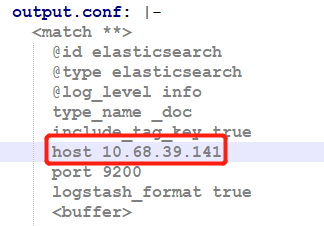

# k8s-efk
K8S ElasticSearch Fluent Kibana集群

---
## 1. 介绍
参考kubernetes官方配置进行集群部署https://github.com/kubernetes/kubernetes/tree/master/cluster/addons/fluentd-elasticsearch

同时，对官方配置参数进行优化

## 2. ElasticSearch调参
2.1 设置JVM参数
标准的建议是把 50％ 的可用内存作为 Elasticsearch 的堆内存，保留剩下的 50％,需要修改env参数和mem参数
`resources:
	  # need more cpu upon initialization, therefore burstable class
	  limits:
		cpu: 1000m
	  requests:
		cpu: 100m`
			
`env:
	- name: "NAMESPACE"
	  valueFrom:
		fieldRef:
		  fieldPath: metadata.namespace
	- name: ES_JAVA_OPTS
		value: "-Xms2g -Xmx10g"
	- name: discovery.zen.minimum_master_nodes
		value: "2"`

2.2 ES的集群配置
进入${ES_HOME}/conf/elasticsearch.yml

* cluster.name，集群名，同一个集群下配置同一个名字
* node.name，节点名，同一个集群下不同节点配置不同的名称
* path.data，数据存储目录，生产环境中需要指定一个容量比较大的磁盘
* path.logs，日志存储目录
* network.host，本机ip
* http.port，默认为9200
* discovery.zen.ping.unicast.hosts，集群中其他机器的ip地址

配置完毕后重启ES，另一台机器上配置类似后重启，ES即可自动发现。

2.3 常见命令
集群配置完毕后，集群间的数据是共享的。即使其中任何一台机器挂了，通过另一台机器也能访问全部的数据
1. 访问集群状态
访问http://ip:port/_cat/health?v查看集群状态
* node.total=2表示集群中的节点
2. 查看集群master状态
* http://ip:port/_cat/master?pretty
3. 查看ElasticSearch所有索引
* http://ip:port/_cat/indices

2.4 定期删除数据
如果不删除ES数据，将会导致ES存储的数据越来越多，磁盘满了之后将无法写入新的数据。这时可以使用脚本定时删除过期数据。
输入：crontab -e

输入内容：分 时 日 月 周 命令

30 23 * * 7 /root/efk/cron-delete-es.sh

然后按Esc输入  :wq   即可。

每周日晚上23：30执行一次。

定时任务执行log文件地址：/var/spool/mail/root 可查看执行错误信息。

可以视个人情况调整保留的天数，这里的ip和port同样设置为不存储数据的那台机器。该脚本只需要在ES中一台机器定时运行即可。

crontab -e添加定时任务,每天的凌晨一点清除索引。

`0 1 * * * /search/odin/elasticsearch/scripts/es-index-clear.sh`

2.5 拉取镜像
* docker pull quay.io/fluentd_elasticsearch/elasticsearch:v7.2.0
* docker tag quay.io/fluentd_elasticsearch/elasticsearch:v7.2.0 172.16.18.62/public/elasticsearch:v7.2.0
* docker push 172.16.18.62/public/elasticsearch:v7.2.0
* 修改yml,kubectl apply -f es-statefulset.yaml es-service.yaml

3. Fluent安装
3.1 拉取本地镜像
* docker pull quay.io/fluentd_elasticsearch/fluentd:v2.7.0
* docker tag quay.io/fluentd_elasticsearch/fluentd:v2.7.0 172.16.18.62/public/fluentd:v2.7.0
* docker push 172.16.18.62/public/fluentd:v2.7.0

3.2 运行yaml文件
kubectl apply -f fluentd-es-configmap.yaml

！注意，fluent-es-configmap的host需要修改成IP，如果使用到了dns则不用

4. Kibana配置
4.1 拉取本地镜像
* docker pull docker.elastic.co/kibana/kibana-oss:7.2.0
* docker tag docker.elastic.co/kibana/kibana-oss:7.2.0 172.16.18.62/public/kibana/kibana-oss:v7.2.0
* docker push 172.16.18.62/public/kibana/kibana-oss:v7.2.0

4.2 修改kibana-deployment.yaml文件
`env:
          - name: ELASTICSEARCH_HOSTS
            value: http://10.68.39.141:9200`

5. elasticsearch管理工具
1. 首先下载zip压缩包：https://github.com/360EntSecGroup-Skylar/ElasticHD/releases/download/1.4/elasticHD_linux_amd64.zip
2. 修改权限：chmod -R 777 ElasticHD
3. 运行: ./ElasticHD -p 127.0.0.1:9800

## 批量删除pod
* `kubectl -n kube-system  get pods | grep Evicted |awk '{print$1}'|xargs kubectl -n kube-system delete`
* `kubectl get pods --all-namespaces| grep mysql |awk '{cmd="kubectl delete pod "$2" -n "$1;system(cmd)}'`
遇到无法删除的
* `kubectl get pods --all-namespaces| grep mysql |awk '{cmd1="kubectl patch pod "$2" -n "$1" -p '\''""{\"metadata\":{\"finalizers\":null}}""'\''";system(cmd1)}'`

volume支持两种方式，一种是直接挂载，一种是通过PVC挂载

### 一、直接挂载
1. 目前仅支持EmptyDir,NFS,Glusterfs,HostPath四种存储类型，后续将增加其他类型；
2. 如何使用，通过以下可以，例如申请type为1的nfs存储，可以直接挂载

`"volumeReqs":[
      	{
      		"type":1,
      		"name":"nfs-fast",
      		"args":{
      			"path":"/nfs",
      			"server":"172.16.18.146"
      		}
      	}]`
		
### 二、通过PVC来挂载，可以实现动态管理
1. 直接挂载的方式无法动态创建PV，一个POD只能挂载一个path挂载点，每次都需要手动创建nfs的PV
2. 使用PVC来挂载，虽然也需要每次创建PV和PVC（一个PV只能和一个PVC绑定，
但多个POD可以共用一个PVC），但通过PVC的StorageClass可以使用实现动态创建PV，POD不用关心磁盘
配合从哪来，直接用就可以，详见https://www.cnblogs.com/DaweiJ/articles/8618317.html。
3. 用法，API请求，注意volumesReq是和containters参数并列的，不在里面，type也必须去掉

`"volumeReqs":[
  	{
  		"name":"nfs-pvc",
  		"persistentVolumeClaim":{
          			"claimName": "test-claim"
        		}
  	}
  ]`
  
4. 注意，一个pvc只能同时被一个POD使用，如果多个PVC，需要先建立一个PVC池，Client端维护
这个PVC的Pooling，创建POD的时候，分配没有使用的PVC的name给POD，POD删除后会回收PVC，
不会删除nfs上的数据。
5. 删除POD不会释放PVC，需要手动删除，调用/api/v1/namespaces/monitoring/persistentvolumeclaims/{pvcname}
的DELETE方法。
6. PVC删除后PV也会自动删除，如果PVC采用claimPolicy=DELETE策略，nfs上的存储也不会真的删除，
会改为目录改为archieved-开头的名字，还是要求nfs服务器上执行手动删除，可以写一个定时任务，定时删除
archieved开头的文件目录。
7. 动态PV创建，PVC会自动在nfs的根目录下面创建namespace-pvcname的文件目录，看不到别人的文件，
实现权限隔离，但是nfs对配额不会限制，每个用户都可以使用/nfs这个挂载卷的最大配额，
一种解决是改造nfs实现二级目录的配额管理，另一种是通过应用手动实现逻辑配额管理。